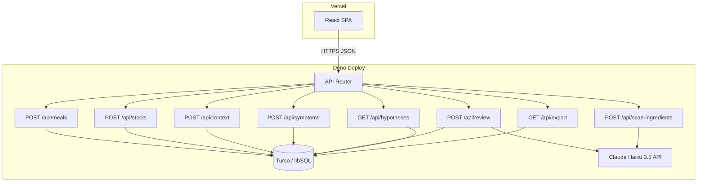
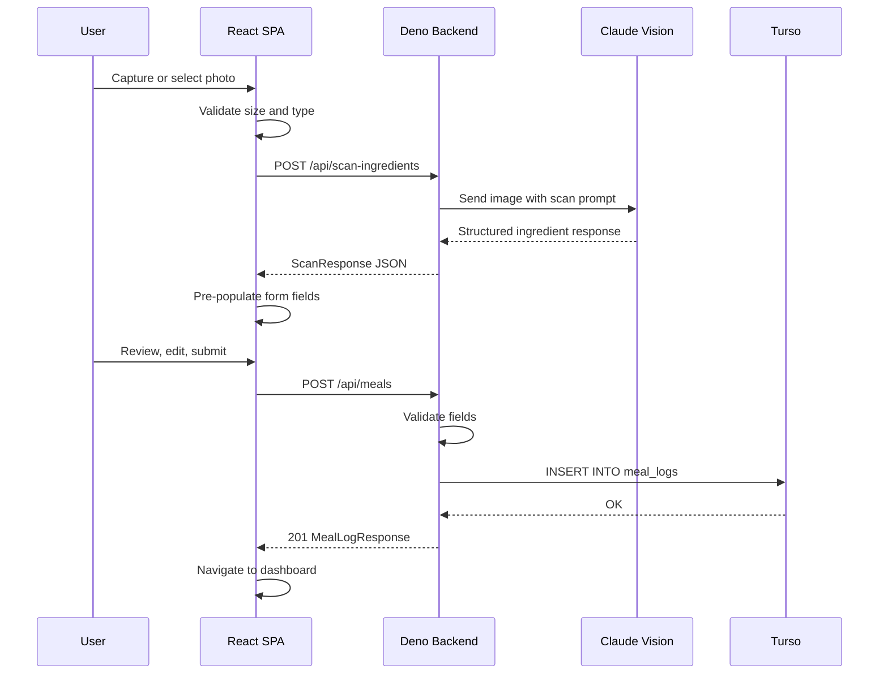
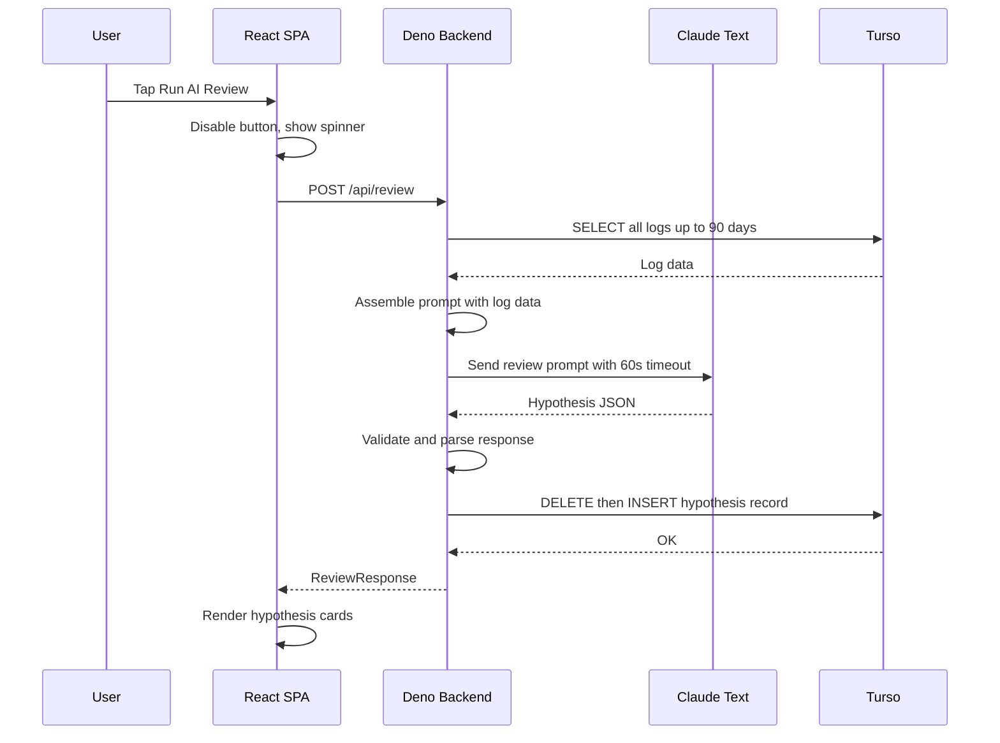

# Design Document — IBS Trigger Tracker

## Overview

The IBS Trigger Tracker ("iPoop") is a personal, mobile-first web application with a React SPA frontend and Deno edge-function backend. Users log meals (with FODMAP tagging), stool events (Bristol Scale), daily lifestyle context, and symptoms. An AI hypothesis engine (Claude Haiku 3.5) correlates logged data over a 6–24 hour transit window to surface probable dietary and lifestyle triggers with confidence ratings.

The system is split into two deployable units:
- **Frontend** — React 18 SPA built with Vite, styled with Tailwind CSS v3, routed with React Router, hosted on Vercel.
- **Backend** — Deno Deploy edge functions (TypeScript), connecting to Turso (libSQL/SQLite) for persistence and the Anthropic Claude API for AI features.

All communication between frontend and backend is via a JSON REST API over HTTPS. There is no multi-user authentication — the app serves a single user.

## Architecture



### Key Architectural Decisions

| Decision | Rationale |
|----------|-----------|
| Single Deno entry point with file-based route handlers | Keeps deployment simple on Deno Deploy; each route file is self-contained |
| Turso (libSQL) over Postgres/Supabase | SQLite semantics are sufficient for single-user; Turso provides edge-compatible HTTP driver |
| ULIDs for all PKs | Lexicographically sortable, no coordination needed, works well with SQLite text columns |
| Hypotheses as single-row overwrite | Simplifies reads (always one record); history is not required per spec |
| Images never persisted | Privacy-by-design; only extracted structured data is stored |
| CORS restricted to single origin | Single-user app; no need for open API access |
| AI calls server-side only | Protects API key; allows prompt engineering without client exposure |

## Components and Interfaces

### Frontend Components

```
src/
├── components/
│   ├── BottomNav.tsx           # Fixed bottom navigation (5 tabs)
│   ├── QuickLogButton.tsx      # Reusable quick-log action button
│   ├── HypothesisCard.tsx      # Single hypothesis display card
│   ├── LogEntryCard.tsx        # Generic log entry summary card (history)
│   ├── FodmapCheckboxes.tsx    # Multi-select FODMAP category picker
│   ├── BristolPicker.tsx       # Bristol scale 1-7 selector
│   ├── SeveritySlider.tsx      # 0-10 severity input
│   ├── PhotoCapture.tsx        # Camera/file input for ingredient scan
│   ├── IngredientBreakdown.tsx # Expandable scan results display
│   ├── ConfidenceBadge.tsx     # Visual confidence indicator
│   ├── Disclaimer.tsx          # Medical disclaimer component
│   └── LoadingSpinner.tsx      # Loading state indicator
├── pages/
│   ├── DashboardPage.tsx       # / route
│   ├── MealLogPage.tsx         # /log/meal route
│   ├── StoolLogPage.tsx        # /log/stool route
│   ├── ContextLogPage.tsx      # /log/context route
│   ├── SymptomLogPage.tsx      # /log/symptoms route
│   ├── HistoryPage.tsx         # /history route
│   ├── HypothesesPage.tsx      # /hypotheses route
│   └── SettingsPage.tsx        # /settings route
├── hooks/
│   ├── useApi.ts               # Fetch wrapper with error handling
│   ├── useDashboardSummary.ts  # Dashboard data fetching
│   └── useInfiniteHistory.ts   # Paginated history loading
└── lib/
    ├── api.ts                  # API client (base URL, fetch helpers)
    ├── validators.ts           # Client-side form validation
    └── types.ts                # Shared TypeScript interfaces
```

### Backend Components

```
backend/
├── routes/
│   ├── meals.ts               # CRUD for meal_logs
│   ├── stools.ts              # CRUD for stool_logs
│   ├── context.ts             # CRUD for context_logs
│   ├── symptoms.ts            # CRUD for symptom_logs
│   ├── scan-ingredients.ts    # POST: image → Claude vision → structured response
│   ├── review.ts              # POST: trigger hypothesis generation
│   ├── hypotheses.ts          # GET: fetch current hypothesis record
│   └── export.ts              # GET: full data export (JSON or CSV)
├── db/
│   ├── schema.sql             # Table definitions
│   ├── migrations/            # Incremental schema changes
│   ├── client.ts              # Turso client initialisation
│   └── queries.ts             # Parameterised query functions
├── ai/
│   ├── scan-prompt.ts         # Claude vision prompt for ingredient extraction
│   ├── review-prompt.ts       # Claude text prompt for hypothesis generation
│   └── client.ts              # Anthropic SDK client initialisation
├── lib/
│   ├── cors.ts                # CORS middleware
│   ├── validate.ts            # Server-side validation utilities
│   ├── ulid.ts                # ULID generation
│   └── errors.ts              # Standardised error responses
├── main.ts                    # Entry point: request routing + CORS
└── deno.json                  # Deno config, import map, tasks
```

### API Interface Contracts

#### Meal Log — `POST /api/meals`

**Request Body:**
```typescript
interface CreateMealRequest {
  meal_type?: "breakfast" | "lunch" | "dinner" | "snack";
  description: string;              // 1–500 chars, required
  fodmap_flags?: ("F" | "O" | "D" | "M" | "P")[];
  ingredients?: string[];           // max 50 items, each max 100 chars
  fodmap_detail?: Record<string, string[]>; // FODMAP category → ingredient names
  portion_size?: "small" | "medium" | "large";
  eating_speed?: "slow" | "normal" | "fast";
  scan_used?: boolean;
}
```

**Response (201):**
```typescript
interface MealLogResponse {
  id: string;          // ULID
  logged_at: string;   // ISO8601
  meal_type: string | null;
  description: string;
  fodmap_flags: string[];
  ingredients: string[];
  fodmap_detail: Record<string, string[]>;
  portion_size: string | null;
  eating_speed: string | null;
  scan_used: number;   // 0 or 1
}
```

#### Stool Log — `POST /api/stools`

**Request Body:**
```typescript
interface CreateStoolRequest {
  bristol_type: number;            // 1–7, required
  frequency?: number;              // 1–20
  urgency?: boolean;
  pain_score?: number;             // 0–10
  blood?: boolean;
  notes?: string;                  // max 1000 chars
}
```

#### Context Log — `POST /api/context`

**Request Body:**
```typescript
interface CreateContextRequest {
  stress_score?: number;           // 1–10
  sleep_hours?: number;            // 0.0–24.0
  sleep_quality?: number;          // 1–5
  water_litres?: number;           // 0.0–20.0
  exercise_type?: "none" | "walk" | "gym" | "run" | "other";
  exercise_duration?: number;      // 0–1440 minutes
  caffeine_mg?: number;            // 0–2000
  alcohol_units?: number;          // 0.0–50.0
  medications?: string;            // max 500 chars
  menstrual_phase?: "follicular" | "ovulatory" | "luteal" | "menstrual" | "n/a";
  notes?: string;                  // max 1000 chars
}
```

#### Symptom Log — `POST /api/symptoms`

**Request Body:**
```typescript
interface CreateSymptomRequest {
  bloating: number;    // 0–10, required
  cramping: number;    // 0–10, required
  nausea: number;      // 0–10, required
  urgency: number;     // 0–10, required
  fatigue: number;     // 0–10, required
  overall: number;     // 0–10, required
  notes?: string;      // max 1000 chars
}
```

#### Ingredient Scan — `POST /api/scan-ingredients`

**Request Body:**
```typescript
interface ScanRequest {
  image_base64: string;  // base64-encoded image (max 5MB decoded)
  mime_type: "image/jpeg" | "image/png" | "image/gif" | "image/webp";
}
```

**Response (200):**
```typescript
interface ScanResponse {
  description: string;
  ingredients: string[];
  fodmap_flags: ("F" | "O" | "D" | "M" | "P")[];
  fodmap_detail: Record<string, string[]>;
  confidence: "high" | "medium" | "low";
  notes?: string;
}
```

#### AI Review — `POST /api/review`

**Response (200):**
```typescript
interface ReviewResponse {
  id: string;                    // ULID
  reviewed_at: string;           // ISO8601
  summary: string;               // Plain-English summary paragraph
  days_analysed: number;
  entries_analysed: number;
  hypotheses: Hypothesis[];
}

interface Hypothesis {
  trigger_name: string;
  fodmap_category: string;
  confidence_score: number;      // 0.00–0.95
  confidence_label: "Low" | "Moderate" | "High" | "Very High";
  direction: "worsens" | "improves" | "unclear";
  symptom_pattern: string;
  supporting_events: number;
  contradicting_events: number;
  notes?: string;
}
```

#### Data Export — `GET /api/export?format=json|csv`

Returns a downloadable file (JSON) or zip of CSV files.

### Error Response Format

All API errors follow a consistent shape:

```typescript
interface ApiError {
  error: string;           // Machine-readable error code
  message: string;         // Human-readable description
  fields?: Record<string, string>; // Per-field validation errors
}
```

HTTP status codes: 400 (validation), 422 (unprocessable), 500 (server error), 503 (upstream unavailable).

## Data Models

### Database Schema (SQLite / Turso)

```sql
CREATE TABLE meal_logs (
  id          TEXT PRIMARY KEY,          -- ULID
  logged_at   TEXT NOT NULL,             -- ISO8601
  meal_type   TEXT,                      -- breakfast|lunch|dinner|snack
  description TEXT NOT NULL,             -- max 500 chars
  fodmap_flags TEXT NOT NULL DEFAULT '[]', -- JSON array of F/O/D/M/P
  ingredients TEXT NOT NULL DEFAULT '[]', -- JSON array of strings (max 50)
  fodmap_detail TEXT NOT NULL DEFAULT '{}', -- JSON object {category: [ingredients]}
  portion_size TEXT,                     -- small|medium|large
  eating_speed TEXT,                     -- slow|normal|fast
  scan_used   INTEGER NOT NULL DEFAULT 0 -- 0 or 1
);

CREATE TABLE stool_logs (
  id           TEXT PRIMARY KEY,         -- ULID
  logged_at    TEXT NOT NULL,            -- ISO8601
  bristol_type INTEGER NOT NULL,         -- 1–7
  frequency    INTEGER,                  -- 1–20
  urgency      INTEGER,                  -- 0 or 1
  pain_score   INTEGER,                  -- 0–10
  blood        INTEGER,                  -- 0 or 1
  notes        TEXT                      -- max 1000 chars
);

CREATE TABLE context_logs (
  id                TEXT PRIMARY KEY,    -- ULID
  logged_at         TEXT NOT NULL,       -- ISO8601
  stress_score      INTEGER,            -- 1–10
  sleep_hours       REAL,               -- 0.0–24.0
  sleep_quality     INTEGER,            -- 1–5
  water_litres      REAL,               -- 0.0–20.0
  exercise_type     TEXT,               -- none|walk|gym|run|other
  exercise_duration INTEGER,            -- 0–1440 minutes
  caffeine_mg       INTEGER,            -- 0–2000
  alcohol_units     REAL,               -- 0.0–50.0
  medications       TEXT,               -- max 500 chars
  menstrual_phase   TEXT,               -- follicular|ovulatory|luteal|menstrual|n/a
  notes             TEXT                -- max 1000 chars
);

CREATE TABLE symptom_logs (
  id        TEXT PRIMARY KEY,            -- ULID
  logged_at TEXT NOT NULL,               -- ISO8601
  bloating  INTEGER NOT NULL,            -- 0–10
  cramping  INTEGER NOT NULL,            -- 0–10
  nausea    INTEGER NOT NULL,            -- 0–10
  urgency   INTEGER NOT NULL,            -- 0–10
  fatigue   INTEGER NOT NULL,            -- 0–10
  overall   INTEGER NOT NULL,            -- 0–10
  notes     TEXT                         -- max 1000 chars
);

CREATE TABLE hypotheses (
  id               TEXT PRIMARY KEY,     -- ULID
  reviewed_at      TEXT NOT NULL,        -- ISO8601
  summary          TEXT NOT NULL,        -- Plain-English summary
  days_analysed    INTEGER NOT NULL,
  entries_analysed INTEGER NOT NULL,
  hypotheses_json  TEXT NOT NULL         -- JSON array of Hypothesis objects
);
```

### Indexes

```sql
CREATE INDEX idx_meal_logs_logged_at ON meal_logs(logged_at);
CREATE INDEX idx_stool_logs_logged_at ON stool_logs(logged_at);
CREATE INDEX idx_context_logs_logged_at ON context_logs(logged_at);
CREATE INDEX idx_symptom_logs_logged_at ON symptom_logs(logged_at);
```

### Validation Rules Summary

| Logger | Field | Type | Range |
|--------|-------|------|-------|
| Meal | description | string | 1–500 chars (required) |
| Meal | meal_type | enum | breakfast, lunch, dinner, snack |
| Meal | fodmap_flags | array | subset of {F, O, D, M, P} |
| Meal | ingredients | array | 0–50 items, each ≤100 chars |
| Meal | portion_size | enum | small, medium, large |
| Meal | eating_speed | enum | slow, normal, fast |
| Stool | bristol_type | int | 1–7 (required) |
| Stool | frequency | int | 1–20 |
| Stool | pain_score | int | 0–10 |
| Stool | notes | string | ≤1000 chars |
| Context | stress_score | int | 1–10 |
| Context | sleep_hours | decimal | 0.0–24.0 |
| Context | sleep_quality | int | 1–5 |
| Context | water_litres | decimal | 0.0–20.0 |
| Context | exercise_duration | int | 0–1440 |
| Context | caffeine_mg | int | 0–2000 |
| Context | alcohol_units | decimal | 0.0–50.0 |
| Context | exercise_type | enum | none, walk, gym, run, other |
| Context | menstrual_phase | enum | follicular, ovulatory, luteal, menstrual, n/a |
| Symptom | bloating, cramping, nausea, urgency, fatigue, overall | int | 0–10 (all required) |
| Symptom | notes | string | ≤1000 chars |

### Data Flow Diagrams

#### Meal Logging with Photo Scan



#### AI Hypothesis Review




## Correctness Properties

*A property is a characteristic or behavior that should hold true across all valid executions of a system — essentially, a formal statement about what the system should do. Properties serve as the bridge between human-readable specifications and machine-verifiable correctness guarantees.*

### Property 1: Log entry round-trip persistence

*For any* valid log entry (meal, stool, context, or symptom) with any combination of valid optional fields, creating the entry via the API and then reading it back SHALL produce an object with all fields identical to the original input (plus the generated ULID and ISO8601 timestamp).

**Validates: Requirements 1.1, 1.2, 1.3, 2.1, 3.1, 3.2, 3.9, 4.1**

### Property 2: Validation rejects out-of-range numeric fields

*For any* numeric field in any logger (bristol_type, pain_score, frequency, stress_score, sleep_hours, sleep_quality, water_litres, exercise_duration, caffeine_mg, alcohol_units, bloating, cramping, nausea, urgency, fatigue, overall), if the provided value falls outside the specified valid range, the logger SHALL reject the entire entry and return an error response identifying the invalid field(s).

**Validates: Requirements 1.7, 2.2, 2.3, 2.4, 3.3, 3.4, 3.5, 3.8, 4.2, 4.3**

### Property 3: Description length boundary enforcement

*For any* string, the meal logger SHALL accept it as a description if and only if its trimmed length is between 1 and 500 characters inclusive. Empty strings, whitespace-only strings, and strings exceeding 500 characters SHALL be rejected.

**Validates: Requirements 1.7**

### Property 4: Invalid enum values are rejected

*For any* string that is not a member of the allowed enum set for a given field (meal_type, portion_size, eating_speed, exercise_type, menstrual_phase), the corresponding logger SHALL reject the entry with a validation error.

**Validates: Requirements 1.8, 3.6, 3.7**

### Property 5: FODMAP flag subset acceptance

*For any* subset of the set {F, O, D, M, P} (including the empty set), the meal logger SHALL accept it as valid FODMAP flags. *For any* array containing a string not in {F, O, D, M, P}, the meal logger SHALL reject it.

**Validates: Requirements 1.2**

### Property 6: Transit window correlation correctness

*For any* set of meal logs and symptom logs, the hypothesis engine's correlation logic SHALL identify a symptom event (any dimension ≥ 4) as correlated with a meal if and only if the symptom's timestamp falls within 6–24 hours after the meal's timestamp.

**Validates: Requirements 6.2**

### Property 7: Confidence label assignment

*For any* confidence score in [0.00, 0.95], the hypothesis engine SHALL assign the label "Low" if score ∈ [0.00, 0.39], "Moderate" if score ∈ [0.40, 0.64], "High" if score ∈ [0.65, 0.84], and "Very High" if score ∈ [0.85, 0.95]. The assigned label SHALL always match exactly one range.

**Validates: Requirements 6.7**

### Property 8: Confidence caps based on data sufficiency and supporting events

*For any* hypothesis result, if fewer than 7 days of log data exist then all confidence scores SHALL be ≤ 0.39 (Low only). If fewer than 14 days exist then all scores SHALL be ≤ 0.64 (Moderate max). If supporting_events < 3 then the confidence score SHALL be ≤ 0.50.

**Validates: Requirements 6.8, 6.9**

### Property 9: Confounder confidence reduction

*For any* hypothesis where one or more lifestyle confounders are elevated (stress ≥ 7, sleep quality ≤ 2, or water < 1.0L) on the same symptom day, the confidence score SHALL be reduced by at least 0.15 compared to the score without confounders present.

**Validates: Requirements 6.3**

### Property 10: CORS origin enforcement

*For any* HTTP request with an Origin header, the CORS middleware SHALL include Access-Control-Allow-Origin in the response if and only if the Origin matches the configured CORS_ORIGIN value. Requests from non-matching origins SHALL be rejected.

**Validates: Requirements 12.3**

### Property 11: History entries are grouped by day in reverse chronological order

*For any* set of log entries with varying timestamps, the history grouping function SHALL return entries grouped by calendar day (UTC) in reverse chronological order (most recent day first), and within each day group, entries SHALL be sorted by logged_at descending.

**Validates: Requirements 8.1**

### Property 12: JSON export contains all persisted records

*For any* set of records across all 5 tables, the JSON export SHALL produce an object with exactly 5 keys (meal_logs, stool_logs, context_logs, symptom_logs, hypotheses), where each key maps to an array containing every record from that table with all fields preserved.

**Validates: Requirements 10.1, 10.2**

### Property 13: CSV export produces valid files with correct headers

*For any* set of records, the CSV export SHALL produce one file per table where each file has a header row matching the table's column names and one data row per record, with all field values correctly serialized.

**Validates: Requirements 10.3**

### Property 14: All generated IDs are valid ULIDs and all timestamps are valid ISO8601

*For any* log entry created by the system, the `id` field SHALL match the ULID format (26 uppercase alphanumeric characters, Crockford Base32) and the `logged_at` field SHALL be a valid ISO8601 datetime string.

**Validates: Requirements 12.4**

### Property 15: AI response schema validation

*For any* JSON object returned by the Claude API (for both scan and review operations), the response parser SHALL accept it if and only if it conforms to the expected schema (ScanResponse or ReviewResponse). Malformed responses SHALL result in a structured error, never a crash or partial data storage.

**Validates: Requirements 5.2, 6.6**

### Property 16: Export filename pattern

*For any* export request with a given format ("json" or "csv") and current date, the generated filename SHALL match the pattern `ipoop-export-{format}-{YYYY-MM-DD}` exactly.

**Validates: Requirements 10.5**

## Error Handling

### Error Response Strategy

All errors return a consistent `ApiError` JSON shape:

```typescript
{
  error: string;           // Machine-readable code (e.g., "VALIDATION_ERROR")
  message: string;         // Human-readable description
  fields?: Record<string, string>; // Per-field errors (validation only)
}
```

### Error Categories

| Category | HTTP Status | Trigger | Behaviour |
|----------|-------------|---------|-----------|
| Validation | 400 | Invalid field values, missing required fields | Return field-level errors; do not persist |
| Unprocessable | 422 | Structurally valid but semantically wrong (e.g., unsupported image type) | Return descriptive message |
| AI Timeout | 504 | Claude API exceeds timeout (15s scan, 60s review) | Return timeout error; preserve existing data |
| AI Unavailable | 503 | Claude API unreachable | Return service unavailable; allow retry |
| Database Error | 500 | Turso connection failure | Return generic storage error; never expose connection details |
| CORS Rejected | 403 | Origin not matching CORS_ORIGIN | Block response body entirely |

### Error Handling Rules

1. **Validation errors are atomic** — if any field in an entry fails validation, the entire entry is rejected. No partial persistence.
2. **AI failures are non-destructive** — if a review or scan fails, existing data (hypotheses, form state) is preserved unchanged.
3. **No internal details leak** — database URLs, auth tokens, and stack traces are never included in client-facing error responses.
4. **Client-side errors are recoverable** — all error states in the UI include a clear message and an action (retry, fix input, or dismiss).
5. **Timeouts are explicit** — scan operations timeout at 15 seconds, review operations at 60 seconds. Both return a specific timeout error code.

### Frontend Error Handling

- API client (`lib/api.ts`) wraps all fetch calls with try/catch and maps HTTP errors to user-friendly messages.
- Form validation runs client-side first (immediate feedback) and server-side second (authoritative).
- Network failures show a toast notification with retry option.
- AI scan/review failures show inline error with "Try Again" button.

## Testing Strategy

### Testing Approach

The project uses a dual testing strategy:

1. **Property-based tests** — verify universal correctness properties across randomised inputs (100+ iterations per property)
2. **Example-based unit tests** — verify specific scenarios, edge cases, and UI interactions
3. **Integration tests** — verify external service interactions (Claude API, Turso) with mocks

### Property-Based Testing

**Library:** [fast-check](https://github.com/dubzzz/fast-check) (TypeScript, works with both Deno and Node/Vitest)

**Configuration:**
- Minimum 100 iterations per property test
- Each test tagged with: `Feature: ibs-trigger-tracker, Property {N}: {title}`
- Properties test pure logic functions extracted from route handlers

**Property Test Targets:**

| Property | Module Under Test | Key Generators |
|----------|-------------------|----------------|
| 1: Round-trip persistence | `db/queries.ts` | Random valid log entries (all types) |
| 2: Numeric validation | `lib/validate.ts` | Random integers/decimals inside and outside ranges |
| 3: Description length | `lib/validate.ts` | Random strings of varying lengths (0–1000) |
| 4: Enum validation | `lib/validate.ts` | Random strings + valid enum members |
| 5: FODMAP subset | `lib/validate.ts` | Random subsets of {F,O,D,M,P} + invalid chars |
| 6: Transit window | `ai/correlation.ts` | Random timestamp pairs with known offsets |
| 7: Confidence labels | `ai/confidence.ts` | Random floats in [0.00, 0.95] |
| 8: Confidence caps | `ai/confidence.ts` | Random day counts + event counts + scores |
| 9: Confounder reduction | `ai/confidence.ts` | Random scores + confounder states |
| 10: CORS enforcement | `lib/cors.ts` | Random origin strings |
| 11: History grouping | `db/queries.ts` | Random entries with varying timestamps |
| 12: JSON export | `routes/export.ts` | Random multi-table datasets |
| 13: CSV export | `routes/export.ts` | Random multi-table datasets |
| 14: ULID/ISO8601 format | `lib/ulid.ts` | Generated IDs and timestamps |
| 15: AI response schema | `ai/parsers.ts` | Random JSON objects (valid + invalid shapes) |
| 16: Export filename | `routes/export.ts` | Random dates + format selections |

### Unit Tests (Example-Based)

**Frontend:** Vitest + React Testing Library
- Form validation feedback (specific invalid inputs)
- Component rendering (BottomNav, HypothesisCard, etc.)
- Navigation flows (submit → dashboard)
- Empty states and placeholders
- Disclaimer presence on all pages

**Backend:** Deno test runner
- Enum acceptance (each valid value + representative invalid)
- Default values (scan_used defaults to 0)
- Single hypothesis record constraint (overwrite behaviour)
- File type validation for scans
- Image size rejection at 5MB boundary

### Integration Tests

**Mocked external services:**
- Claude API responses (scan + review) — mock with representative payloads
- Turso database — use in-memory libSQL for fast integration tests
- CORS — test with various Origin headers

**Key integration scenarios:**
- Full meal logging flow with photo scan
- AI review with insufficient data (< 7 days)
- AI review with confounders present
- Database failure handling (mock connection error)
- Export with empty tables

### Test Organisation

```
frontend/
├── src/__tests__/
│   ├── components/       # Component unit tests
│   ├── pages/            # Page-level integration tests
│   └── lib/              # Utility function tests

backend/
├── tests/
│   ├── properties/       # Property-based tests (fast-check)
│   ├── unit/             # Example-based unit tests
│   └── integration/      # Integration tests with mocks
```

### CI Pipeline

1. `pnpm test` — frontend unit + property tests (Vitest)
2. `deno test` — backend unit + property + integration tests
3. `pnpm build` — verify frontend builds without errors
4. `deno lint && deno fmt --check` — code quality
